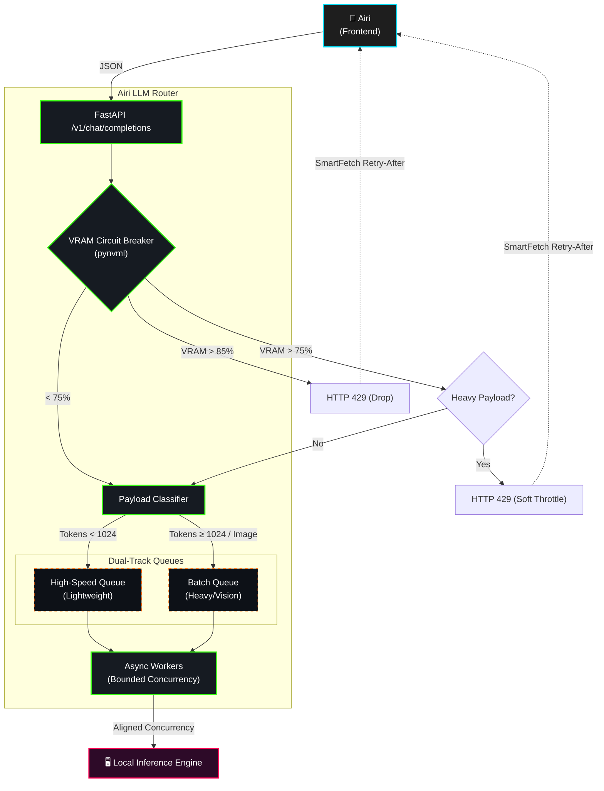

# Airi LLM Router

[English](README.md) | [简体中文](README_zh.md) | [日本語](README_ja.md)


A highly concurrent, hardware-aware gateway for LLM inference orchestration. Built on FastAPI and `asyncio`, it mediates traffic between frontend clients and local GPU inference engines (e.g., Ollama, vLLM).

## 1. System Architecture



## 2. Core Mechanisms

### 2.1 Hardware-Aware Circuit Breaker
A daemon polls the NVIDIA GPU via `pynvml` at 1.0s intervals to monitor VRAM allocation.
- **< 75%**: Normal operation.
- **75% - 85%**: Soft-throttling. Rejects heavy/multimodal payloads with `HTTP 429`; allows lightweight requests.
- **> 85%**: Hard circuit breaker. Halts incoming traffic with exponential backoff `Retry-After` headers.

### 2.2 Payload Classifier & Offloading
Intercepts incoming OpenAI-compatible payloads and classifies them (`LIGHTWEIGHT`, `HEAVY`, `MULTIMODAL`). Base64 image payloads are offloaded to disk, replacing memory-heavy arrays with lightweight file references to preserve gateway RAM.

### 2.3 Dual-Track Priority Routing
Resolves Head-of-Line (HoL) blocking by routing payloads into separate queues:
- **High-Speed Queue**: For low-latency conversational queries.
- **Batch Queue**: For computationally expensive document/vision tasks.
A strict pool of `N` asynchronous workers (aligned with the GPU's max parallel threshold) drains the queues, preventing context thrashing.

---

## 3. Benchmark & Validation

### Test Environment
- **GPU**: NVIDIA RTX 5070 Ti (16GB VRAM)
- **Engine**: Qwen 2.5 (7B) via Ollama
- **Load**: 150 concurrent mixed requests (70% lightweight, 30% heavy tasks).

### 3.1 Head-of-Line (HoL) Blocking Resolution
By routing conversational tasks to the **High-Speed Queue** via the `Payload Classifier`, lightweight queries bypass heavy document processing entirely.

- **Lightweight Chat**: P95 latency dropped from **14.6s** to **1.5s** (**89.7% reduction**).
- **Heavy Context**: Maintained a stable execution path (15.1s to 17.2s).


### 3.2 VRAM & Concurrency Backpressure
Ollama pre-allocates VRAM statically (**62%** baseline), so concurrent stress shifts entirely into **inference queuing delays (Latency)**.

1. **Queue Buildup (0s - 12s)**: 150 requests flood the gateway. Response latencies climb while physical VRAM remains flat at 62%.
2. **Backpressure Trigger (13.1s)**: The circuit breaker activates at the 75% WARNING timeline to prevent system timeouts.
3. **Load Shedding**: The router drops heavy incoming traffic and returns **HTTP 429 Throttled** (crimson `X` markers).
4. **Client-Side Handling**: The `smartFetch` interceptor catches 429s, applies a `setTimeout` retry sleep, and dispatches an `airi-vram-warning` event to let the UI show a gentle waiting notice instead of crashing.


---

## 4. Deployment

### Prerequisites
- Docker & Docker Compose
- NVIDIA GPU with drivers (`nvidia-smi` must be available)
- Node.js (v18+)

### Step 1: Directory Structure
Ensure that the `airi-llm-router` is cloned alongside the main frontend repository (either `airi` or `airi-companion`) in the same parent directory:
```text
parent-directory/
├── airi/                  # The official Airi frontend (or airi-companion)
└── airi-llm-router/       # This gateway repository
```

### Step 2: Bootstrapping & Transparent Proxy
Airi LLM Router acts as a **Transparent Proxy**. We provide a NodeJS launcher that automatically scans the adjacent frontend codebase, hot-patches the network layer to gracefully handle HTTP 429 backpressure warnings, and forcefully redirects all outgoing LLM requests to the local gateway. 

**Zero frontend UI configuration is required.**

```bash
# Inside the airi-llm-router directory
node airi-launcher.js
```

### Manual Boot (Standalone Mode)
If you wish to bypass the launcher and deploy the gateway independently:
```bash
cp .env.example .env
docker compose up -d
```
