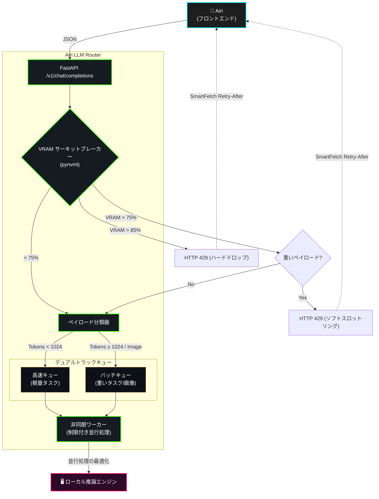
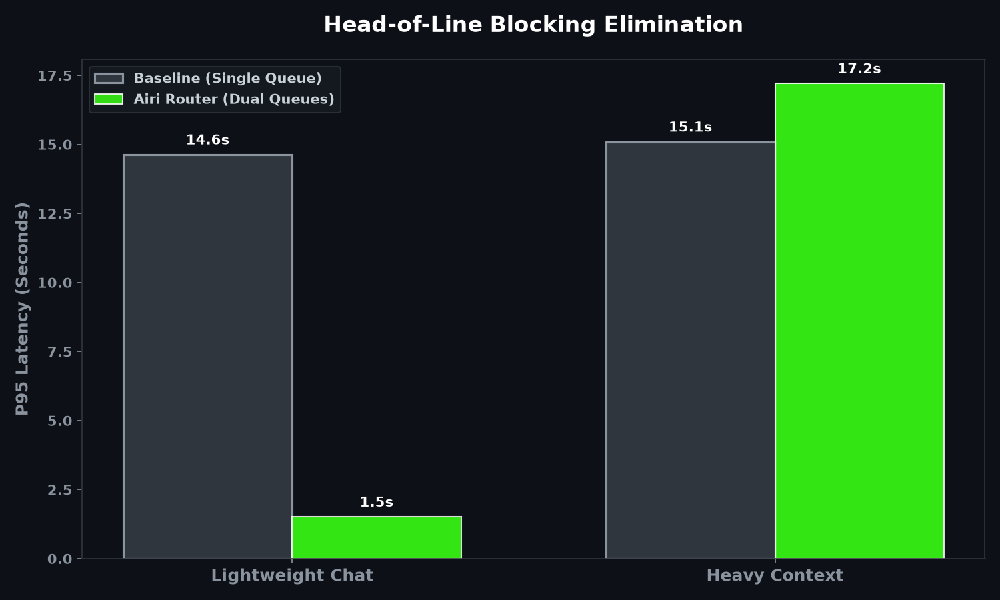
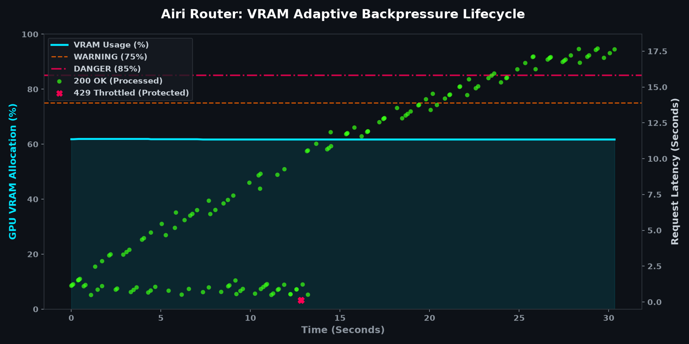

# Airi LLM Router

[English](README.md) | [简体中文](README_zh.md) | [日本語](README_ja.md)


LLM 推論オーケストレーションのための、高並行かつハードウェア対応のゲートウェイです。FastAPI と `asyncio` をベースに構築され、フロントエンドクライアントとローカル GPU 推論エンジン（Ollama、vLLM など）間のトラフィックを調停します。

## 1. システムアーキテクチャ



## 2. コアメカニズム

### 2.1 ハードウェア対応サーキットブレーカー
デーモンプロセスが `pynvml` を介して NVIDIA GPU を 1.0 秒間隔でポーリングし、VRAM の割り当てを監視します。
- **< 75%**: 通常動作。すべてのトラフィックを許可します。
- **75% - 85%**: ソフトスロットリング。重いタスクやマルチモーダルなペイロードを `HTTP 429` で拒否し、軽量なリクエストのみを許可します。
- **> 85%**: ハードサーキットブレーカー。すべての受信トラフィックを遮断し、Exponential Backoff に基づく `Retry-After` ヘッダー付きのレスポンスを返します。

### 2.2 ペイロードの分類とオフローディング
受信した OpenAI 互換のペイロードを傍受し、分類（`LIGHTWEIGHT`、`HEAVY`、`MULTIMODAL`）します。Base64 画像のペイロードはディスクにオフロードされ、メモリを大量に消費する配列を軽量なファイル参照に置き換えることで、ゲートウェイの RAM を保護します。

### 2.3 デュアルトラック優先ルーティング
ペイロードを別々のキューにルーティングすることで、Head-of-Line (HoL) ブロッキングを解消します：
- **高速キュー**: 低遅延の会話型クエリ用。
- **バッチキュー**: 計算コストの高いドキュメント/視覚タスク用。
GPU の最大並列しきい値に一致する `N` 個の非同期ワーカーの厳密なプールがキューを消費し、コンテキスト・スラッシングを防ぎます。

---

## 3. ベンチマークと性能検証

### テスト環境
- **GPU**: NVIDIA RTX 5070 Ti (16GB VRAM)
- **推論エンジン**: Qwen 2.5 (7B) via Ollama
- **テスト負荷**: 150の同時混在リクエスト（70% 軽量チャット、30% 重厚なタスク）。

### 3.1 行頭ブロッキング（HoL Blocking）の完全解消
`Payload Classifier` により通常の対話タスクを **High-Speed Queue（高速専用キュー）** に振り分けることで、軽量リクエストの計算待ちを完全に回避しました。

- **軽量チャット**: P95 レテンシが **14.6秒** から **1.5秒** へ激減（**遅延を 89.7% 削減**）。
- **重厚コンテキスト**: 15.1秒から17.2秒への安定した実行パスを維持。



### 3.2 VRAM と同時実行バックプレッシャ
Ollama の VRAM 事前割り当てにより、物理 VRAM 使用率は **62%** で固定されます。そのため、同時実行負荷は VRAM の上昇ではなく、**推論エンジンのキューイング遅延（Latency）の暴騰**として現れます。

1. **キュー蓄積 (0s - 12s)**: 150のリクエストが直撃し、エンジン内部のキューが飽和。VRAM は 62% のままで応答レテンシが上昇。
2. **バックプレッシャ作動 (13.1s)**: レテンシが限界に達すると、サーキットブレーカーが 75% WARNING ラインのタイミングで介入。
3. **制御された負荷廃棄**: ルーターは過負荷トラフィックをドロップし、直ちに **HTTP 429 Throttled**（赤色の `X` マーカー）を返却。
4. **フロントエンド適応型クローズドループ**: `smartFetch` インターセプターが 429 をキャッチして `setTimeout` による非同期スリープを実行。同時に `airi-vram-warning` イベントを発行し、UI 上に警告を表示させながらクラッシュを防ぎ自動再試行を行います。



---

## 4. デプロイメント

### 前提条件
- Docker & Docker Compose
- NVIDIA GPU とドライバー (`nvidia-smi` が利用可能であること)
- Node.js (v18+)

### ステップ 1: ディレクトリ構造
`airi-llm-router` がフロントエンドのメインリポジトリ（`airi` または `airi-companion`）と同じ親ディレクトリにクローンされていることを確認してください。
```text
parent-directory/
├── airi/                  # Airi 公式フロントエンド (または airi-companion)
└── airi-llm-router/       # このゲートウェイリポジトリ
```

### ステップ 2: 起動と透過的プロキシ (Transparent Proxy)
Airi LLM Router は**透過的プロキシ**として機能します。付属の NodeJS ランチャーを実行すると、隣接するフロントエンドのコードベースを自動的にスキャンし、HTTP 429 バックプレッシャー警告を優雅に処理するホットパッチをネットワーク層に注入します。さらに、送信されるすべての LLM リクエストをローカルゲートウェイへ**強制的にリダイレクト**します。

**フロントエンド UI 側での設定は一切不要です。**

```bash
# airi-llm-router ディレクトリ内で実行
node airi-launcher.js
```

### 手動起動 (スタンドアロンモード)
ランチャーを使用せず、ゲートウェイを単独でデプロイする場合：
```bash
cp .env.example .env
docker compose up -d
```
