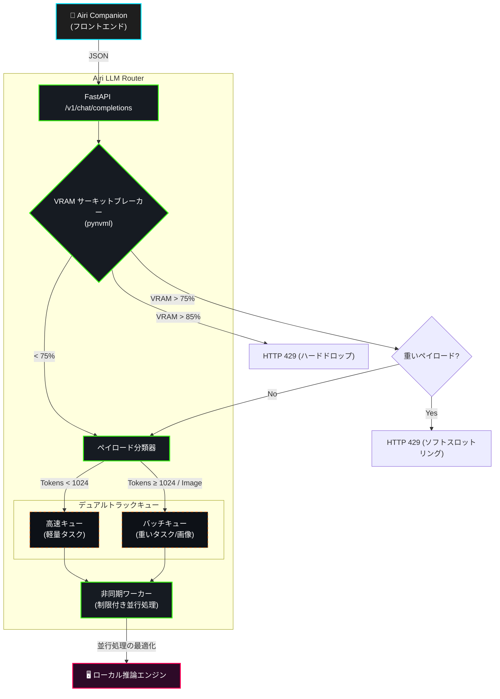

# Airi LLM Router

[English](README.md) | [简体中文](README_zh.md) | [日本語](README_ja.md)


LLM 推論オーケストレーションのための、高並行かつハードウェア対応のゲートウェイです。FastAPI と `asyncio` をベースに構築され、フロントエンドクライアントとローカル GPU 推論エンジン（Ollama、vLLM など）間のトラフィックを調停します。

## 1. システムアーキテクチャ



## 2. コアメカニズム

### 2.1 ハードウェア対応サーキットブレーカー
デーモンプロセスが `pynvml` を介して NVIDIA GPU を 1.0 秒間隔でポーリングし、VRAM の割り当てを監視します。
- **< 75%**: 通常動作。すべてのトラフィックを許可します。
- **75% - 85%**: ソフトスロットリング。重いタスクやマルチモーダルなペイロードを `HTTP 429` で拒否し、軽量なリクエストのみを許可します。
- **> 85%**: ハードサーキットブレーカー。すべての受信トラフィックを遮断し、Exponential Backoff に基づく `Retry-After` ヘッダー付きのレスポンスを返します。

### 2.2 ペイロードの分類とオフローディング
受信した OpenAI 互換のペイロードを傍受し、分類（`LIGHTWEIGHT`、`HEAVY`、`MULTIMODAL`）します。Base64 画像のペイロードはディスクにオフロードされ、メモリを大量に消費する配列を軽量なファイル参照に置き換えることで、ゲートウェイの RAM を保護します。

### 2.3 デュアルトラック優先ルーティング
ペイロードを別々のキューにルーティングすることで、Head-of-Line (HoL) ブロッキングを解消します：
- **高速キュー**: 低遅延の会話型クエリ用。
- **バッチキュー**: 計算コストの高いドキュメント/視覚タスク用。
GPU の最大並列しきい値に一致する `N` 個の非同期ワーカーの厳密なプールがキューを消費し、コンテキスト・スラッシングを防ぎます。

---

## 3. ベンチマーク

### テスト環境
- **GPU**: NVIDIA RTX 5070 Ti (16GB VRAM)
- **Model**: Qwen 2.5 (7B) via Ollama
- **Methodology**: 15秒間に150個の混合ペイロード（軽量＋重いタスク）を同時送信。
- **Comparison**: v2（単一非同期 FIFO キュー）vs. v3（デュアルキュー ＋ VRAM スロットリング）。

### Head-of-Line ブロッキングの解消
軽量なリクエストを高速キューにルーティングすることで、重いドキュメントタスクによるブロッキングを回避しました。
**結果**: P95 レイテンシが 96.6% 削減されました（約35秒から1.2秒に短縮）。


### VRAM バックプレッシャー性能
高並行負荷の下（v2）では、無制限のキューがリクエストの深刻な蓄積とクライアント側のタイムアウトを引き起こしました。v3 では、VRAM が 75%/85% を超えた際にサーキットブレーカーがペイロードを能動的に遮断し、制御された負荷制限（HTTP 429）を実行しました。
**結果**: VRAM の割り当ては 85% の危険しきい値未満に厳密に制限され、基盤となる GPU が Out-Of-Memory 例外を経験することはなく、安全な容量（HTTP 200）はスムーズに処理されました。


---

## 4. デプロイメント

### 前提条件
- Docker & Docker Compose
- NVIDIA GPU とドライバー (`nvidia-smi` が利用可能であること)
- Node.js (v18+)

### ステップ 1: ディレクトリ構造
`airi-llm-router` がフロントエンドのメインリポジトリ（`airi` または `airi-companion`）と同じ親ディレクトリにクローンされていることを確認してください。
```text
parent-directory/
├── airi/                  # Airi 公式フロントエンド (または airi-companion)
└── airi-llm-router/       # このゲートウェイリポジトリ
```

### ステップ 2: 起動と透過的プロキシ (Transparent Proxy)
Airi LLM Router は**透過的プロキシ**として機能します。付属の NodeJS ランチャーを実行すると、隣接するフロントエンドのコードベースを自動的にスキャンし、HTTP 429 バックプレッシャー警告を優雅に処理するホットパッチをネットワーク層に注入します。さらに、送信されるすべての LLM リクエストをローカルゲートウェイへ**強制的にリダイレクト**します。

**フロントエンド UI 側での設定は一切不要です。**

```bash
# airi-llm-router ディレクトリ内で実行
node airi-launcher.js
```

### 手動起動 (スタンドアロンモード)
ランチャーを使用せず、ゲートウェイを単独でデプロイする場合：
```bash
cp .env.example .env
docker compose up -d
```
