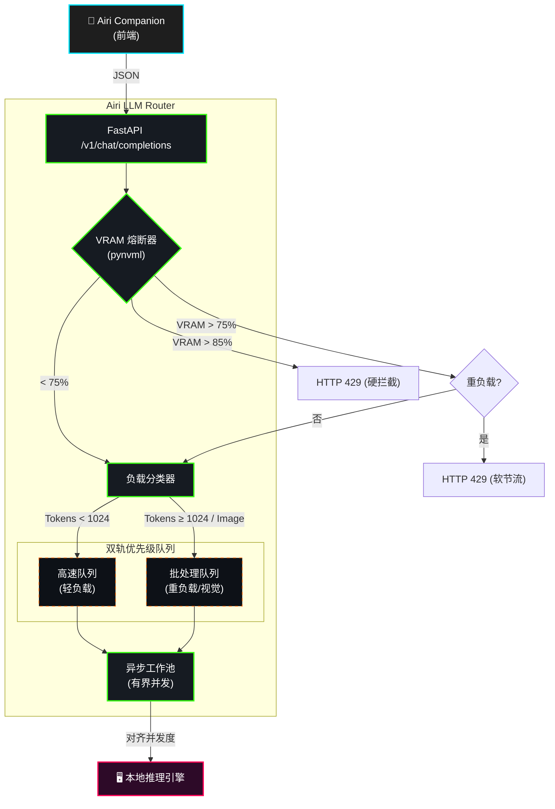

# Airi LLM Router

[English](README.md) | [简体中文](README_zh.md) | [日本語](README_ja.md)


一个高并发、硬件感知的 LLM 推理流量调度网关。基于 FastAPI 和 `asyncio` 构建，作为前端客户端与本地 GPU 推理引擎（如 Ollama、vLLM）之间的中间层。

## 1. 系统架构



## 2. 核心机制

### 2.1 硬件感知熔断器
后台守护进程通过 `pynvml` 以 1.0 秒为周期轮询 NVIDIA GPU，监控显存分配。
- **< 75%**：正常运行，流量全量放行。
- **75% - 85%**：软节流。拒绝重负载/多模态请求（返回 `HTTP 429`），允许轻量级请求通过。
- **> 85%**：硬熔断。拦截所有入站流量，并返回带有指数退避 `Retry-After` 头部的响应。

### 2.2 负载分类与特征提取
拦截兼容 OpenAI 格式的入站请求并进行分类（`LIGHTWEIGHT`、`HEAVY`、`MULTIMODAL`）。Base64 图片负载将被剥离并落盘，使用轻量级文件引用替代占用大量内存的数组，以节省网关内存。

### 2.3 双轨优先级路由
通过将负载分发至不同的队列，彻底消除队头阻塞（HoL Blocking）：
- **高速队列**：处理低延迟的对话请求。
- **批处理队列**：处理高计算成本的长文档/视觉任务。
具有严格容量限制的 `N` 个异步工作池（数量与 GPU 最大并行阈值对齐）负责消费队列，防止显存上下文抖动（Context Thrashing）。

---

## 3. 基准测试 (Benchmark)

### 测试环境
- **GPU**: NVIDIA RTX 5070 Ti (16GB VRAM)
- **Model**: Qwen 2.5 (7B) via Ollama
- **Methodology**: 在 15 秒内并发注入 150 个混合负载（轻负载 + 重负载）。
- **Comparison**: v2（单异步 FIFO 队列）vs. v3（双轨队列 + VRAM 熔断器）。

### 消除队头阻塞 (HoL Blocking)
将轻量级请求路由至高速队列，使其绕过了被重度文档任务阻塞的问题。
**结果**：P95 延迟骤降 96.6%（从约 35 秒降低至 1.2 秒）。


### VRAM 回压机制 (Backpressure)
在高并发负载下（v2），无限制的队列导致请求严重堆积及客户端超时。在 v3 架构中，当显存突破 75%/85% 时，熔断器主动拦截过载请求，执行受控的流量卸载（HTTP 429）。
**结果**：显存占用被严格控制在 85% 危险阈值以下，确保底层 GPU 始终免受 OOM（显存溢出）崩溃威胁，同时安全容量内的请求（HTTP 200）得以平稳处理。


---

## 4. 部署指南

### 环境依赖
- Docker & Docker Compose
- NVIDIA GPU 及驱动（需支持 `nvidia-smi`）
- Node.js (v18+)

### 第 1 步：目录结构要求
请确保 `airi-llm-router` 仓库与前端主仓库（`airi` 或旧版 `airi-companion`）被克隆在同一个父级目录下：
```text
parent-directory/
├── airi/                  # Airi 官方前端仓库 (或 airi-companion)
└── airi-llm-router/       # 本网关仓库
```

### 第 2 步：一键启动与无感代理 (Transparent Proxy)
Airi LLM Router 的设计理念是**无感代理**。我们提供了一个 NodeJS 启动器，它会自动嗅探相邻的前端代码库，对其网络层进行热补丁注入，使其能够优雅地处理 HTTP 429 回压警告，并**强制劫持所有发出的 LLM 请求至本地网关**。

**前端 UI 完全零配置，开箱即用。**

```bash
# 在 airi-llm-router 目录下执行
node airi-launcher.js
```

### 手动独立启动
如果你希望绕过启动器，单独部署本网关：
```bash
cp .env.example .env
docker compose up -d
```
